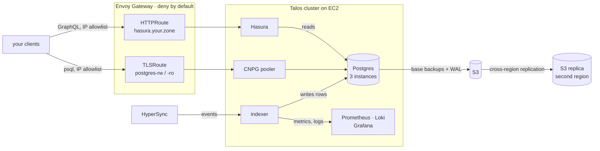

# HyperIndex OpenInfra — Self-Hosted HyperIndex for Everyone

A free, self-hosted alternative to [HyperIndex Cloud](https://envio.dev/pricing/hosting) Offering that aims for 100% feature parity with @enviodev's dedicated plan.

You only need a HyperSync token, not a HyperIndex cloud plan.

Terraform brings up a [Talos Linux](https://www.talos.dev/) Kubernetes cluster on EC2 — no
EKS, no control-plane bill — and [Flux](https://fluxcd.io/) converges everything else from
this repo: Postgres, Hasura, the indexer, TLS, DNS, dashboards and alerts. Every tier
feature below is a manifest you can read.

## What you get

- **Nothing is metered.** Chains, contracts, storage, query rate, indexing hours. You pay
  EC2, not per hour indexed.
- **Direct database access** — `-rw` and `-ro` TLS endpoints straight at the CNPG pooler,
  each behind its own Envoy RBAC allowlist. Gated to the Dedicated plan upstream.
- **Every alert the Production tier ships**, routed to email, plus platform-level ones.
- **A static GraphQL endpoint** on your own DNS zone, Let's Encrypt certs renewed by
  cert-manager, records managed by external-dns.
- **Backups you own** — CNPG base backups and WAL archiving to your S3 bucket, on a
  schedule, with retention, replicated to a second region.
- **Secrets from 1Password**, pulled in by External Secrets and picked up on rotation by
  Reloader — no redeploy to change a variable.
- **Grafana included**, with dashboards for indexer health and the cluster underneath it.
- **No lock-in.** It is your AWS account, your cluster, your database.

### Feature parity

✅ is in the tree, 🚧 is not yet, — is something that stops being a feature once the
infrastructure is yours.

| | Dedicated plan | Here |
|---|---|---|
| **Pricing & capacity** | | |
| | | |
| Price | Custom, on top of $70–$800/mo tiers | ✅ no licence fee — you pay AWS for the nodes you run, and nothing else |
| Indexing hours | Metered, $0.10–$0.50 per hour beyond the included 800 | ✅ unmetered |
| Long-term discount | Included | ✅ EC2 reserved instances or a savings plan, at AWS's own rates |
| Multichain indexing | ∞ chains | ✅ ∞ — bounded only by node capacity |
| Query rate limit | 5,000 / minute | ✅ no limit imposed; Envoy is yours to configure |
| Approx storage | Unlimited | ✅ EBS volumes you size |
| Number of contracts | Unlimited | ✅ no limit |
| Backfill speed | Extreme | ✅ same HyperSync, your own `ENVIO_API_TOKEN` |
| | | |
| **Reliability** | | |
| | | |
| No auto-deletion over limits | Included | ✅ nothing deletes your data |
| Static production endpoint | Included | ✅ stable hostname, cert-manager TLS, external-dns |
| Backups | Multiregion | ✅ CNPG → S3, base + WAL, scheduled with retention, replicated cross-region |
| Zero-downtime deployments | Included | ✅ 3-instance Postgres and pooler, Hasura at 2 replicas behind a PDB; the indexer is deliberately single-replica |
| Alerting & monitoring | Included | ✅ see below |
| | | |
| **Security** | | |
| | | |
| IP whitelisting | Included | ✅ deny-by-default Envoy `SecurityPolicy` on the GraphQL route, CIDR-gated Grafana |
| Direct database access | Dedicated only | ✅ `-rw` / `-ro` TLS endpoints, per-route RBAC allowlists |
| API-key authentication | Included | ✅ Hasura's admin secret is required on every request to the GraphQL endpoint, held in 1Password and rotated there |
| Unlisted deployments | Dedicated only | ✅ nothing is published anywhere by default |
| | | |
| **Extras** | | |
| | | |
| Environment variable management | Included, needs a redeploy | ✅ `cluster-vars` + 1Password, live via Reloader |
| Development instance | 2 deployments, configurable | ✅ as many envs as you declare |
| Image rollout | Managed | ✅ Keel polls the registry and rolls the indexer forward |
| Effects API cache management | Production+ | ✅ effect caches are tables in your own Postgres — warm across restarts and rollouts, and covered by the backup schedule |
| Subgraph-compatible endpoint | Paid add-on | 🚧 |
| ClickHouse support | Dedicated add-on | 🚧 |
| Hosted analytics portal | Paid add-on | 🚧 |
| Custom SLA, roadmap priority, support channel | Included | — you are the operator now |

### Alerts

Grafana alert rules, delivered by email. `info` is muted by default, so only `warning`
and `critical` reach you. Every alert the Production tier offers:

| Envio alert | Here |
|---|---|
| **Indexer Stopped Processing** `WARNING` | ✅ *Indexer stopped processing* — no block advanced for 10m while behind head |
| **Production Endpoint Down** `CRITICAL` | ✅ *Production endpoint down* — no healthy Hasura upstreams behind the GraphQL route, for 2m |
| **Indexer Restart** `INFO` | ✅ *Indexer restart* — fires on the restart |
| **Indexer Failing** `CRITICAL` | ✅ two rules: *Indexer restart loop* (more than two restarts in an hour) and *Indexer scrape target down* (Prometheus cannot reach it for 2m) |
| **Indexer Error Logs** `INFO` | ✅ *Indexer error logs* — error or fatal lines in the last 5m, from Loki |
| **Historical Sync Complete** `INFO` | ✅ *Historical sync complete* — reached the chain head |

## The stack

Both ways in cross the same gateway, which denies anything not on the allowlist; the
indexer and Hasura talk to Postgres directly, and only outside clients go through the
pooler.

| layer | |
|---|---|
| Cloud | AWS — EC2, VPC, S3, IAM |
| Provisioning | Terraform + `just` |
| OS / Kubernetes | Talos Linux, immutable and API-managed |
| GitOps | Flux CD |
| Ingress | Envoy Gateway (Gateway API), cert-manager, external-dns via Cloudflare |
| Database | CloudNativePG + barman-cloud, pooled `-rw`/`-ro` endpoints over TLS |
| Secrets | External Secrets Operator reading 1Password, Reloader on rotation |
| Observability | kube-prometheus-stack, Grafana, Alloy, Loki, Tempo |
| Policy | Kyverno, plus Envoy RBAC in front of the Postgres listeners |

## Layout

| | |
|---|---|
| [`infra/`](infra/staging/README.md) | Terraform per environment — the VPC, the Talos cluster, the backup bucket and its cross-region replica. Nodes are described in `config.json`; that README covers sizing, dedicating a node to a workload, upgrades and backups. |
| [`clusters/entrypoints/`](clusters/entrypoints/README.md) | One `<env>/<cluster>` per Flux bootstrap target, and the variables each cluster sets. |
| [`clusters/packages/layer-zero/`](clusters/packages/layer-zero/README.md) | The platform package — secrets, gateway, CNPG, observability — and its `platform-vars` contract. |
| [`clusters/apps/`](clusters/apps/README.md) | The chain-indexer itself: Postgres, Hasura, the indexer, routes, dashboards, alerts. |

## Getting started

Prerequisites, credentials and the four commands that stand a cluster up live in
[GUIDE.md](GUIDE.md).

## Status

Built in the open, and running. Infrastructure, platform and the chain-indexer app are all
in the tree; what is left is the 🚧 rows above — analytics over the indexed data, a
ClickHouse deployment for the entities that want one, and a subgraph-compatible endpoint.
